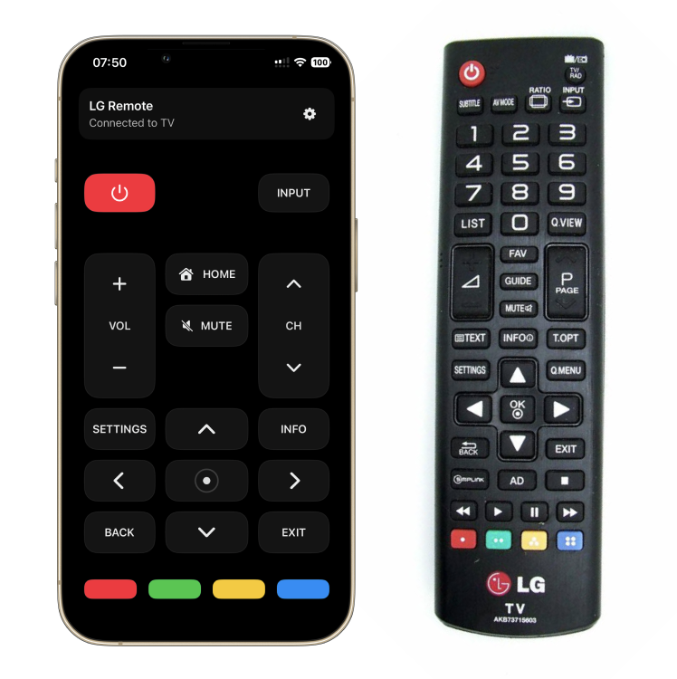
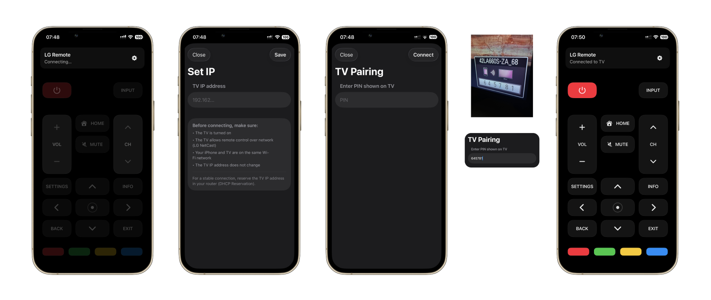

# LG NetCast Remote (iOS)

  

*A modern iOS remote inspired by the original LG TV controller.*

## What is this?

A fast and stable iOS remote app for **LG NetCast TVs (≈2011–2014)**.

The idea came from a simple problem:  
most existing LG remote apps are **slow, unstable, full of ads**, and often lose connection.

So I built my own: **minimal, instant, and predictable**.

## Built with

Swift · SwiftUI · Combine

## Supported TVs

- LG TVs with **NetCast OS**
- Approx. **2011–2014 models**
- Tested on **LG 42LA660S** 

**Not compatible with webOS TVs**

## How it connects

On the **first launch**, the app automatically opens the connection setup.

Before connecting, make sure:
- The **TV is turned on**
- The **TV and iPhone are on the same Wi-Fi network**

Helpful tips and reminders are shown directly in the app during setup.

### Connection steps

1. Enter the **TV IP address** shown in the network settings
2. The TV displays a **pairing PIN**
3. Enter the PIN on the iPhone
4. The remote connects **instantly**

> For a stable connection, the TV IP address should not change.  
> It is recommended to reserve the TV IP in your router  
> (DHCP reservation).

## Demo

**Video: controlling the TV in real time**

[Watch demo](assets/demo.mp4)
